# Design Document

## Overview

The Video Frame Overlay micro SaaS is a web-based application that provides a simple interface for users to add custom frame overlays to their videos. The system leverages FFmpeg for video processing and follows a modern web architecture with a React frontend, Node.js backend, and cloud storage for file handling.

## Architecture

### High-Level Architecture

```mermaid
graph TB
    A[React Frontend] --> B[Node.js API Server]
    B --> C[FFmpeg Processing Service]
    B --> D[File Storage Service]
    B --> E[Payment Service]
    B --> F[Job Queue System]
    C --> G[Temporary File System]
    D --> H[Cloud Storage]
```



### Technology Stack

**Frontend:**

- React with TypeScript for type safety
- Tailwind CSS for consistent styling
- React Query for API state management
- File upload with progress tracking using react-hook-multipart

**Backend:**

- Bun with Hono framework
- TypeScript for development consistency
- Multer for file upload handling
- Agenda.js for job processing and scheduling
- MongoDB for job persistence (used by Agenda.js)

**Processing:**

- FFmpeg for video manipulation
- Sharp for image preprocessing
- Temporary file system for processing workspace

**Storage & Infrastructure:**

- Tigris S3 for file storage
- MongoDB for job tracking and user data (Agenda.js)
- Docker for containerization
- Fly.io for container hosting

## Components and Interfaces

### Frontend Components

**UploadInterface Component**

- Drag-and-drop file upload for video and frame
- File validation and preview
- Progress indicators during upload

**TimingControls Component**

- Video timeline scrubber
- Start time and duration input fields
- inputs for timing

**ProcessingStatus Component**

- Job queue visualization
- Progress tracking with percentage
- Error handling and retry options

**ResultsPanel Component**

- Video preview with overlay applied
- Download controls
- Job history management

### Backend API Endpoints

```typescript
// File upload and validation
POST /api/upload/video
POST /api/upload/frame

// Job management
POST /api/jobs/create
GET /api/jobs/:jobId/status
GET /api/jobs/:jobId/result
DELETE /api/jobs/:jobId

// User management
POST /api/users/register
GET /api/users/usage
POST /api/users/upgrade
```

### Processing Service Interface

```typescript
// Agenda.js Job Data Interface
interface ProcessingJobData {
  videoPath: string;
  framePath: string;
  startTime: number;
  duration: number;
  outputPath: string;
  userId: string;
  jobId: string;
}

// Agenda.js Job Interface (extends Agenda's Job type)
interface ProcessingJob extends Agenda.Job<ProcessingJobData> {
  attrs: {
    _id: ObjectId;
    name: string;
    data: ProcessingJobData;
    type: "single" | "normal";
    priority: number;
    nextRunAt: Date;
    lastModifiedBy: string;
    lockedAt?: Date;
    lastRunAt?: Date;
    lastFinishedAt?: Date;
    failedAt?: Date;
    failCount: number;
    failReason?: string;
    progress?: number;
  };
}

interface FFmpegService {
  processVideo(job: ProcessingJob): Promise<string>;
  validateInputs(videoPath: string, framePath: string): Promise<boolean>;
  getVideoMetadata(videoPath: string): Promise<VideoMetadata>;
}

// Agenda.js Job Status Helper
interface JobStatus {
  id: string;
  status: "pending" | "processing" | "completed" | "failed";
  progress: number;
  error?: string;
  createdAt: Date;
  completedAt?: Date;
}
```

## Data Models

### User Model

```typescript
interface User {
  id: string;
  email: string;
  createdAt: Date;
  subscription: "free" | "premium";
  usageQuota: {
    videosProcessed: number;
    monthlyLimit: number;
    resetDate: Date;
  };
}
```

### Job Model

```typescript
interface Job {
  id: string;
  userId: string;
  videoFile: {
    originalName: string;
    path: string;
    size: number;
    duration: number;
  };
  frameFile: {
    originalName: string;
    path: string;
    dimensions: { width: number; height: number };
  };
  parameters: {
    startTime: number;
    duration: number;
  };
  status: JobStatus;
  createdAt: Date;
  completedAt?: Date;
  outputPath?: string;
  error?: string;
}
```

## Error Handling

### File Upload Errors

- Invalid file formats → Clear error message with supported formats
- File size exceeded → Display size limits and suggest compression
- Upload interruption → Automatic retry with progress restoration

### Processing Errors

- FFmpeg execution failure → Log detailed error, show user-friendly message
- Insufficient disk space → Queue management and cleanup procedures
- Invalid timing parameters → Real-time validation with helpful constraints

### System Errors

- Service unavailability → Graceful degradation with status page
- Payment processing issues → Clear error states with retry options
- Queue overflow → Rate limiting and user notification

## Testing Strategy

### Unit Testing

- FFmpeg command generation and validation
